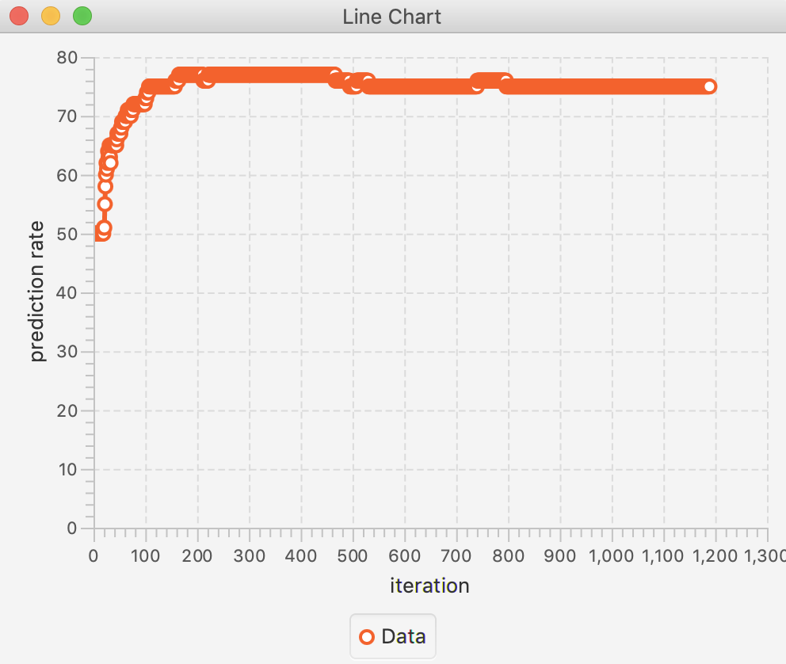

# Machine-Learning-Classification
In this example I want to predict the "creditability" of the customers from the german_credit set. 
The dataset consists of 700 entries with a creditability of 1 and 300 entries with a creditability of 0.  
If we built a predictor that always predicts 1, we would be right in 70% of the cases.  
Therefore we have to divide the data into a test and training set and need to balance the entries. 
This was an exercise out of machine learning course where the data and the scaffold was given. 

## Preview

